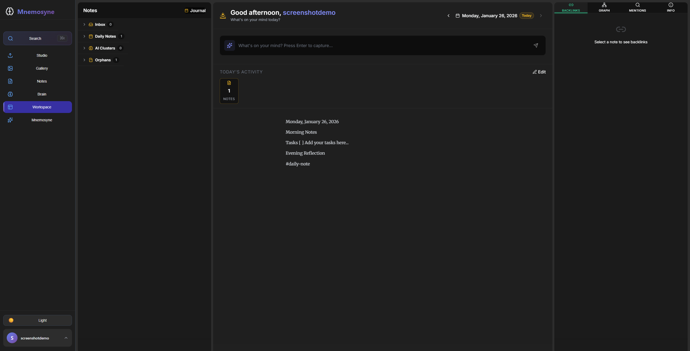
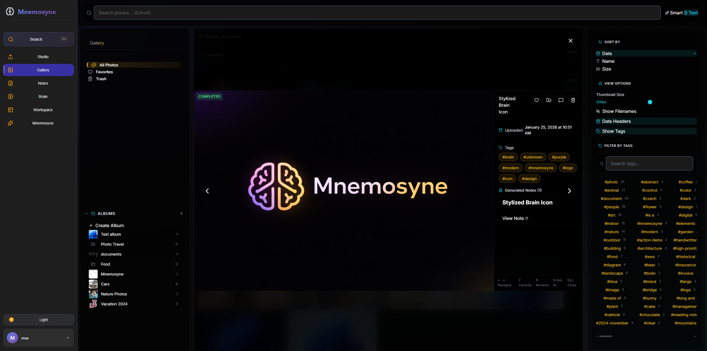

<p align="center">
  <h1 align="center">🧠 Mnemosyne</h1>
  <p align="center"><strong>Your Private AI Brain</strong></p>
  <p align="center">
    <em>Remember Everything. Privately.</em>
  </p>
</p>

<p align="center">
  <a href="#-quick-start">Quick Start</a> •
  <a href="#-features">Features</a> •
  <a href="#-roadmap">Roadmap</a> •
  <a href="#-contributing">Contributing</a> •
  <a href="#-support">Support</a>
</p>

<p align="center">
  
  
  
  
</p>

---

> **🧪 Beta Release** — This is an early version for adventurous users who want to explore AI-powered knowledge management. Perfect for early adopters ready to start building their private AI brain. [See Roadmap →](#-roadmap)

---

## 🌟 Why Mnemosyne?

**Your thoughts deserve better than scattered notes and forgotten bookmarks.**

Mnemosyne is an AI-powered personal knowledge management system that runs **100% locally** on your machine. No cloud. No subscriptions. No data harvesting. Just you and your AI-enhanced second brain.

| What Makes It Different | |
|------------------------|---|
| 🔒 **Truly Private** | Your data never leaves your machine. Period. |
| 🤖 **AI That Understands** | Local AI analyzes your notes and images, finding connections you missed |
| 🕸️ **Living Knowledge Graph** | Watch your ideas connect and evolve visually |
| 📸 **Visual Intelligence** | Upload images and let AI extract text, describe content, and auto-tag |
| 💬 **Ask Your Brain** | Chat with your knowledge base and get citation-backed answers |

---

## 📸 Screenshots

### Daily Workspace
*Start your day with a personalized workspace - quick capture, daily notes, and activity tracking*


### Neural Studio
*Upload images for AI-powered analysis with customizable settings*


### Smart Gallery
*Organize your visual knowledge with albums, tags, and smart filters*


### Image Detail View
*View image details with AI-generated tags, descriptions, and linked notes*


### Notes Management
*Inbox, collections, smart tags, and multiple note types*


### Knowledge Graph (Brain)
*Visualize connections between your notes, tags, and images*


### AI Chat (Mnemosyne)
*Ask questions about your knowledge base with citation-backed answers*


---

## 🚀 Quick Start

Get your private AI brain running in 3 steps:

### Prerequisites
- [Docker](https://www.docker.com/get-started) and Docker Compose
- 8GB RAM minimum (16GB recommended for AI features)
- NVIDIA GPU optional (for faster AI processing)

### Installation

```bash
# 1. Clone the repository
git clone https://github.com/Simmak7/project-Mnemosyne.git
cd project-Mnemosyne

# 2. Configure environment
cp .env.example .env
# Edit .env with your settings (defaults work for most users)

# 3. Launch Mnemosyne
docker-compose up -d --build
```

### First-Time Setup

```bash
# Pull AI models (one-time, ~5GB download)
docker exec -it ollama ollama pull llama3.2-vision:11b
docker exec -it ollama ollama pull nomic-embed-text
```

### Access Your Brain

| Service | URL |
|---------|-----|
| 🖥️ **App** | http://localhost:3000 |
| 📚 **API Docs** | http://localhost:8000/docs |

---

## ✨ Features

### 📝 Smart Note-Taking
- **Rich Text Editor** — Full-featured editor with markdown support
- **[[Wikilinks]]** — Connect ideas with bidirectional links
- **#Hashtags** — Organize with auto-extracted tags
- **Backlinks** — See every note that references the current one

### 📸 Visual Intelligence
- **AI Image Analysis** — Upload photos, get automatic descriptions and tags
- **Text Recognition** — Extract text from images, screenshots, documents
- **Smart Gallery** — Browse, search, and organize your visual knowledge
- **Auto-Generated Notes** — Every image becomes a searchable, linked note

### 🕸️ Knowledge Graph
- **Visual Connections** — See how your ideas link together
- **Interactive Exploration** — Click, zoom, and navigate your knowledge
- **Orphan Detection** — Find isolated notes waiting to be connected
- **Cluster Discovery** — AI groups similar content automatically

### 💬 RAG-Powered AI Chat
- **Ask Anything** — Query your entire knowledge base naturally
- **Citation-Backed** — Every answer shows its sources
- **Context-Aware** — AI understands connections between your notes
- **Streaming Responses** — Real-time answers as AI thinks

### 🪣 Smart Buckets
- **AI Clusters** — Automatically grouped similar notes
- **Inbox** — Recent captures in one place
- **Daily Notes** — Built-in journaling with templates
- **Orphans** — Notes waiting for connections

### 🔍 Semantic Search
- **Search by Meaning** — Find notes by concept, not just keywords
- **Full-Text Search** — Traditional search when you need it
- **Similar Notes** — Discover related content you forgot about
- **Unlinked Mentions** — Find connection opportunities

---

## 🛠️ Tech Stack

| Layer | Technology |
|-------|------------|
| **Frontend** | React 18, TanStack Query, Tiptap Editor, D3.js |
| **Backend** | FastAPI, SQLAlchemy, Celery, Pydantic |
| **Database** | PostgreSQL + pgvector |
| **Cache/Queue** | Redis |
| **AI/ML** | Ollama (100% local inference) |
| **Infrastructure** | Docker Compose |

---

## 🗺️ Roadmap

### Current: v0.1.0-beta (You Are Here)
- ✅ Core note-taking with wikilinks and tags
- ✅ AI image analysis and text recognition
- ✅ Knowledge graph visualization
- ✅ RAG-powered chat with citations
- ✅ Smart buckets and clustering
- ✅ Semantic search

### Next: v0.2.0
- 🔲 Mobile-responsive design improvements
- 🔲 Import from Obsidian, Notion, Evernote
- 🔲 Export your data (Markdown, JSON)
- 🔲 PDF document support
- 🔲 Audio note transcription

### Future Vision
- 🔮 **Browser Extension** — Capture anything from the web
- 🔮 **Mobile App** — Your brain in your pocket
- 🔮 **Collaborative Spaces** — Shared knowledge bases
- 🔮 **Custom AI Training** — Personalize AI to your writing style
- 🔮 **Plugin System** — Extend with community add-ons

> Have ideas? [Open an issue](https://github.com/Simmak7/project-Mnemosyne/issues) — we're building this together!

---

## 🤝 Contributing

Mnemosyne is open source and we love contributions! Whether it's:

- 🐛 Bug reports
- 💡 Feature suggestions
- 📖 Documentation improvements
- 🔧 Code contributions

Check out our [Contributing Guide](CONTRIBUTING.md) to get started.

---

## 💖 Support the Project

Mnemosyne is built with love by a solo developer. If it helps you build your second brain, consider supporting continued development:

<p align="center">
  <a href="https://ko-fi.com/maksymzaiats">
    
  </a>
  <a href="https://github.com/sponsors/Simmak7">
    
  </a>
</p>

**Other ways to help:**
- ⭐ **Star this repo** — It helps others discover Mnemosyne
- 🐛 **Report bugs** — Help us improve
- 📢 **Spread the word** — Tell your friends about private AI

---

## 📜 License

Mnemosyne is open source software licensed under the [GNU Affero General Public License v3.0](LICENSE).

---

<p align="center">
  <strong>Mnemosyne</strong> — Named after the Greek goddess of memory<br>
  <em>Your thoughts. Your images. Your knowledge. Your brain.</em>
</p>

<p align="center">
  Built with 🧠 by <a href="https://github.com/Simmak7">@Simmak7</a>
</p>
