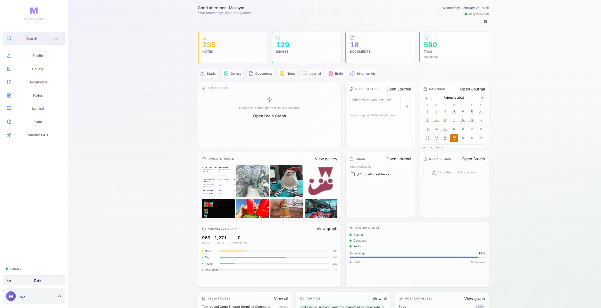
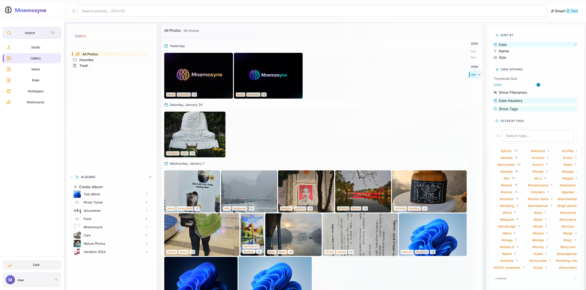
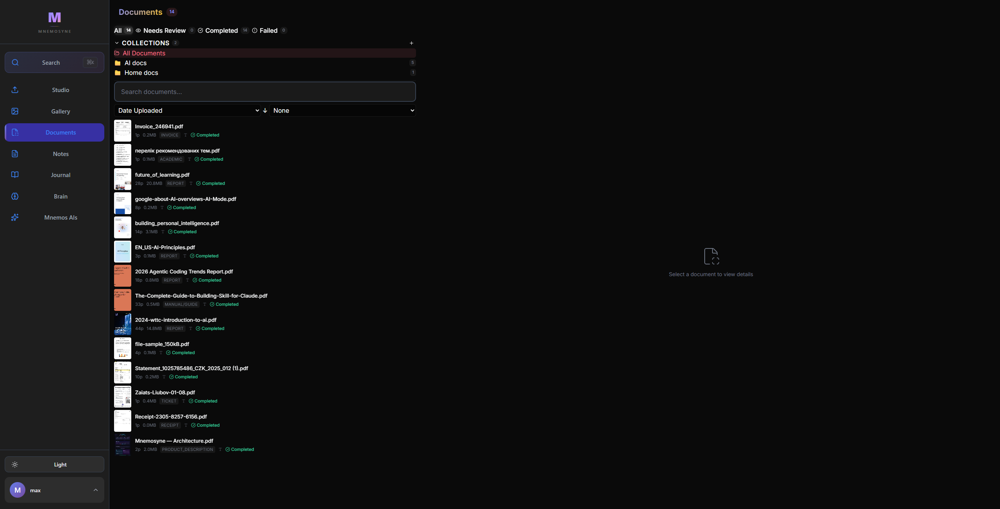
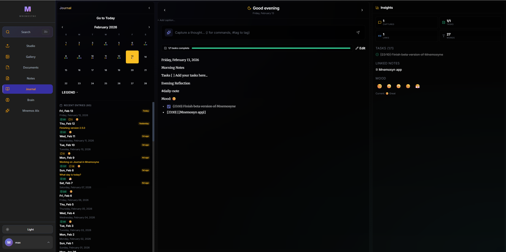
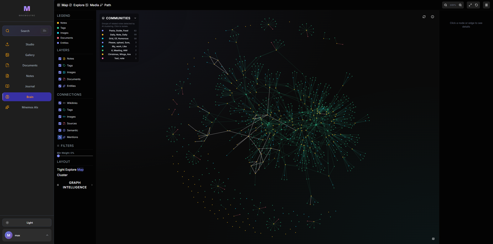
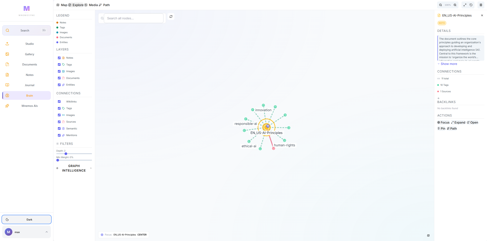
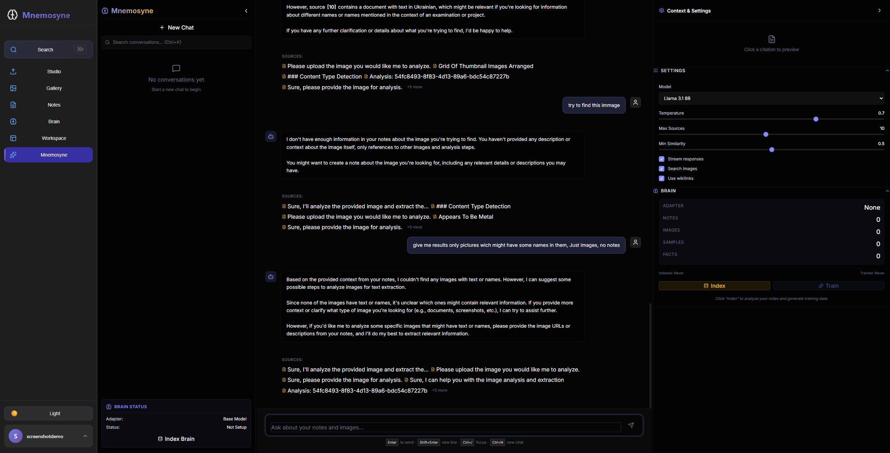
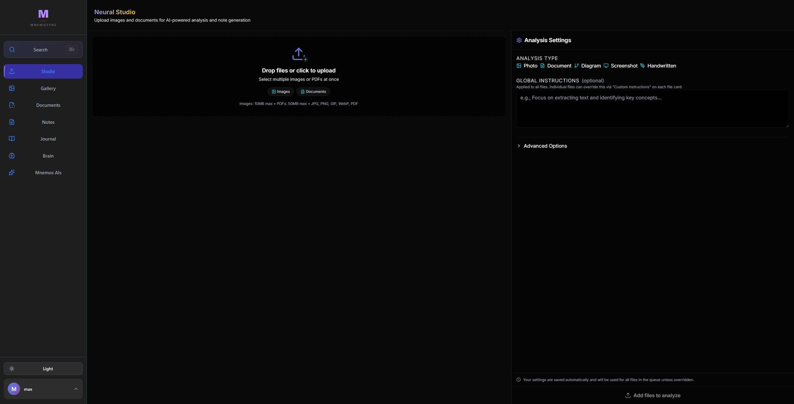

<p align="center">
  <strong style="font-size: 48px;">M</strong>
</p>

<h1 align="center">MNEMOSYNE</h1>

<p align="center">
  <strong>Your Private AI Brain — Remember Everything. Locally.</strong>
</p>

<p align="center">
  
  
  
  
  
  
  
</p>

<p align="center">
  <a href="#quick-start">Quick Start</a> &bull;
  <a href="#features">Features</a> &bull;
  <a href="#screenshots">Screenshots</a> &bull;
  <a href="#tech-stack">Tech Stack</a> &bull;
  <a href="#contributing">Contributing</a> &bull;
  <a href="#support-the-project">Support</a>
</p>

---

> **Beta Release** — Mnemosyne v1.1.3-beta is feature-rich and actively developed. Perfect for early adopters who want a private, AI-powered knowledge management system. [See Roadmap](#roadmap)

---

## Why Mnemosyne?

**Your thoughts deserve better than scattered notes and forgotten bookmarks.**

Mnemosyne is an AI-powered personal knowledge management system that runs **100% locally** on your machine. No cloud. No subscriptions. No data harvesting. Just you and your AI-enhanced second brain.

> **New:** Want more power? Enable experimental **Cloud AI** to connect Claude, ChatGPT, or custom endpoints — for those brave souls who trust Big Brother with their diary entries. Your keys are encrypted, usage is tracked, and you can always retreat back to local-only mode when the paranoia kicks in.

| What Makes It Different | |
|------------------------|---|
| **Truly Private** | Your data never leaves your machine. Period. |
| **AI That Understands** | Local AI analyzes your notes, images, and documents — finding connections you missed |
| **Living Knowledge Graph** | Watch your ideas connect and evolve visually |
| **Visual Intelligence** | Upload images and let AI extract text, describe content, and auto-tag |
| **Document Management** | Upload PDFs for AI enrichment, review, and semantic search |
| **Dashboard Home** | See your entire knowledge base at a glance — metrics, quick capture, calendar, and system health |
| **Ask Your Brain** | Chat with your knowledge base in two modes — retrieval-augmented or brain AI companion |

---

## Screenshots

<table>
  <tr>
    <td colspan="2" align="center">
      <a href="docs/screenshots/dashboard.png"></a>
      <br><strong>Dashboard — Your Knowledge Base at a Glance</strong>
      <br><em>Metrics, Brain Focus, Quick Capture, Calendar, Favorite Images, Tasks, Knowledge Graph stats, and System Status — all in one view</em>
    </td>
  </tr>
  <tr>
    <td width="60%" align="center">
      <a href="docs/screenshots/gallery.png"></a>
      <br><strong>Smart Gallery</strong>
      <br><em>3-column layout with albums, tags, and smart filters</em>
    </td>
    <td width="40%" align="center">
      <a href="docs/screenshots/notes.png"></a>
      <br><strong>Notes Management</strong>
      <br><em>Collections, wikilinks, hashtags, and rich text editing</em>
    </td>
  </tr>
  <tr>
    <td width="50%" align="center">
      <a href="docs/screenshots/documents.png"></a>
      <br><strong>PDF Document Management</strong>
      <br><em>Upload, AI enrichment, review workflow, and collections</em>
    </td>
    <td width="50%" align="center">
      <a href="docs/screenshots/journal.png"></a>
      <br><strong>Daily Journal</strong>
      <br><em>Calendar view with mood tracking, insights, and daily notes</em>
    </td>
  </tr>
  <tr>
    <td width="50%" align="center">
      <a href="docs/screenshots/brain.png"></a>
      <br><strong>Knowledge Graph — Map</strong>
      <br><em>Full knowledge map with communities and semantic clusters</em>
    </td>
    <td width="50%" align="center">
      <a href="docs/screenshots/brain-explore.png"></a>
      <br><strong>Knowledge Graph — Explore</strong>
      <br><em>Focus on any node to see connections, backlinks, and details</em>
    </td>
  </tr>
  <tr>
    <td width="50%" align="center">
      <a href="docs/screenshots/chat.png"></a>
      <br><strong>AI Chat — Dual Mode</strong>
      <br><em>NEXUS RAG retrieval and Brain AI companion with topic memory</em>
    </td>
    <td width="50%" align="center">
      <a href="docs/screenshots/studio.png"></a>
      <br><strong>Upload</strong>
      <br><em>Multi-file upload with real-time AI analysis and customizable settings</em>
    </td>
  </tr>
</table>

---

## Features

### Dashboard
- **Knowledge Base Overview** — See total notes, images, documents, and tags at a glance
- **Brain Focus** — Visualize your current focus node from the Knowledge Graph
- **Quick Capture** — Jot down thoughts instantly without leaving the dashboard
- **Calendar Widget** — Navigate to journal entries with an interactive monthly calendar
- **Favorite Images** — Browse your starred photos right from home
- **Tasks & System Status** — Track your to-dos and monitor Ollama, database, Redis, and embedding health
- **Customizable Layout** — Rearrange and toggle widgets to fit your workflow

### Smart Note-Taking
- **Rich Text Editor** — Full-featured Tiptap editor with markdown support
- **[[Wikilinks]]** — Connect ideas with bidirectional links
- **#Hashtags** — Organize with auto-extracted tags
- **Backlinks** — See every note that references the current one

### Visual Intelligence
- **AI Image Analysis** — Upload photos, get automatic descriptions and tags via Ollama
- **Text Recognition** — Extract text from images, screenshots, and documents
- **Smart Gallery** — 3-column layout with albums and tag filtering
- **Auto-Generated Notes** — Every image becomes a searchable, linked note

### PDF Document Management
- **Upload & AI Enrichment** — Upload PDFs and let AI generate summaries, key points, and tags
- **Review Workflow** — Approve, reject, or edit AI-generated metadata before publishing
- **Unified Collections** — Organize PDFs and notes together in shared collections
- **Full-Text Search** — Semantic search across all document content

### Daily Journal
- **Calendar View** — Navigate entries with an interactive calendar
- **Mood Tracking** — Record and visualize your emotional patterns
- **Daily Insights** — AI-generated reflections on your journal entries
- **Quick Capture** — Fast entry with templates and prompts

### Knowledge Graph
- **Interactive D3.js Visualization** — See how your ideas link together
- **Community Detection** — AI discovers clusters and themes in your knowledge
- **Semantic Edges** — Connections weighted by meaning, not just links
- **Path Finding** — Discover hidden connections between distant ideas

### AI Chat — Dual Mode
- **NEXUS RAG** — Graph-native adaptive retrieval with citation-backed answers from your notes
- **Brain AI Companion** — Persistent AI that remembers topics and builds understanding over time
- **Streaming Responses** — Real-time answers as AI thinks
- **Topic Management** — Organize conversations by subject

### Cloud AI Providers (Experimental)

> *For those who trust Big Brother with their notes — and get 200K token context windows in return.*

- **Claude, ChatGPT & Custom Endpoints** — Connect Anthropic, OpenAI, or any OpenAI-compatible API (Groq, Together AI, etc.)
- **Encrypted API Keys** — Your keys are Fernet-encrypted at rest, never stored in plaintext
- **Per-Feature Model Selection** — Pick different cloud models for RAG chat vs Brain companion
- **Token Usage Tracking** — Monitor your cloud API costs with per-query logging
- **Graceful Fallback** — If the cloud fails, Mnemosyne seamlessly falls back to local Ollama
- **Your Choice** — Local-only by default. Cloud AI is opt-in with clear privacy warnings

### Smart Buckets
- **AI Clusters** — Automatically grouped similar notes
- **Inbox** — Recent captures in one place
- **Orphans** — Notes waiting for connections

### Semantic Search
- **Search by Meaning** — Find notes by concept, not just keywords (pgvector)
- **Full-Text Search** — Traditional search when you need it
- **Cross-Content** — Search across notes, images, and documents simultaneously

---

## Quick Start

Get your private AI brain running in 3 steps:

### Prerequisites
- [Docker](https://www.docker.com/get-started) and Docker Compose
- 8GB RAM minimum (16GB recommended for AI features)
- NVIDIA GPU + [NVIDIA Container Toolkit](https://docs.nvidia.com/datacenter/cloud-native/container-toolkit/latest/install-guide.html) (recommended, not required)

> **No NVIDIA GPU?** Remove the `deploy:` blocks from `ollama` and `celery_worker` in `docker-compose.yml`. AI will run on CPU (slower but works).

### Installation

```bash
# 1. Clone the repository
git clone https://github.com/Simmak7/project-Mnemosyne.git
cd project-Mnemosyne

# 2. Configure environment
cp .env.example .env
# Edit .env with your settings (defaults work for most users)

# 3. Launch Mnemosyne
docker-compose up -d --build
```

### First-Time Setup

```bash
# Pull AI models (one-time, ~8GB total download)
docker exec -it ollama ollama pull qwen2.5vl:7b-q4_K_M   # Vision & image analysis
docker exec -it ollama ollama pull qwen3:8b                # RAG text generation
docker exec -it ollama ollama pull llama3.2:3b             # Brain AI & NEXUS navigation
docker exec -it ollama ollama pull nomic-embed-text        # Semantic embeddings
```

> **About AI Models:** These are the recommended defaults. You can swap models per capability (vision, RAG, Brain) anytime from **Settings > AI Models** — including pulling new models directly from the UI.

### Access Your Brain

| Service | URL |
|---------|-----|
| **App** | http://localhost |
| **API Docs** | http://localhost/docs |

> **Custom port?** Change `WEB_PORT` in `.env` (default: 80). Access at `http://localhost:WEB_PORT`.

---

### The Lazy Way (Let AI Do It)

Don't feel like reading instructions? Just paste this into [Claude Code](https://claude.ai/download), [Cursor](https://cursor.com), or your favorite AI coding assistant:

```
Clone https://github.com/Simmak7/project-Mnemosyne.git, set it up with
Docker, pull all the required Ollama models, and get it running on
localhost. Surprise me when it's done.
```

Sit back, grab a coffee, and let the machines do the work.

---

## Tech Stack

| Layer | Technology |
|-------|------------|
| **Frontend** | React 18, TanStack Query, Tiptap Editor, D3.js |
| **Backend** | FastAPI, SQLAlchemy, Celery, Pydantic |
| **Database** | PostgreSQL + pgvector |
| **Cache/Queue** | Redis |
| **AI/ML** | Ollama (local) + Anthropic, OpenAI (optional cloud) |
| **Infrastructure** | Docker Compose, Nginx reverse proxy |

---

## Roadmap

### v1.1.3-beta (Current Release)
- **Clearer Navigation** — Renamed confusing labels ("Studio" → "Upload", "Brain" → "Knowledge Graph"), added Home button to sidebar with visual divider
- **Browser Back/Forward** — Hash-based URL routing (`/#/notes`, `/#/gallery`) enables browser history navigation and bookmarkable tabs
- **Streamlined Onboarding** — Reduced from 11 steps to 5 focused steps that teach the core workflow
- **Pipeline Visibility** — Toast notifications after uploads with direct navigation to the created note or document
- **Customizable Sidebar** — Hide/show nav items via a Customize button; persists to localStorage; works on mobile too
- **Unified Collections** — Notes and Documents now share one collection system; add both to the same collection with cross-counts
- **Mobile Navigation** — Bottom tab bar with "More" drawer for secondary items, swipe navigation between panels
- **Removed Daily Notes from Notes sidebar** — Journal is now the single entry point for daily notes

### v1.1.2-beta
- **Dashboard Home Page** — Knowledge base overview with customizable widgets (metrics, Brain Focus, Quick Capture, Calendar, Favorite Images, Tasks, Knowledge Graph stats, System Status)
- **Custom Model Selection** — Pick your own Ollama models per capability (vision, RAG, Brain) from Settings
- **Data Export** — Export your notes (Markdown), images, tags, and activity as a downloadable ZIP archive
- **Nginx Reverse Proxy** — Production-ready deployment with proper routing for 2FA, login, and API
- **Self-Hosted Docker Setup** — Single `docker-compose up` deploys everything including Nginx on port 80

### v1.1.1
- **Cloud AI Providers** — Connect Claude, ChatGPT, or any OpenAI-compatible endpoint
- **Encrypted API Key Management** — Fernet-encrypted per-user key storage
- **Token Usage & Cost Tracking** — Monitor your cloud API spend
- **Provider-Aware Model Registry** — Cloud models alongside local Ollama
- **Auto-expanding Chat Input** — Textarea grows with your message

### v1.1.0
- Smart note-taking with wikilinks, hashtags, and backlinks
- AI image analysis with Qwen 2.5 VL vision model
- PDF document management with AI enrichment and review workflow
- Document collections for organizing PDFs
- Daily journal with calendar, mood tracking, and AI insights
- Knowledge graph with community detection, semantic edges, and path finding
- Dual-mode AI chat — NEXUS RAG retrieval + Brain AI companion
- Smart gallery with albums and tag filtering
- Smart buckets with AI clustering and orphan detection
- Semantic search across notes, images, and documents (pgvector)
- Neural Glass design system
- User onboarding flow
- Two-factor authentication (TOTP) and session management

### v1.2.0 (Up Next)
- Import from Obsidian, Notion, Evernote
- Mobile-responsive design improvements
- Browser extension for web clipping
- Audio note transcription

### Future Vision
- **Mobile App** — Your brain in your pocket
- **Collaborative Spaces** — Shared knowledge bases
- **Plugin System** — Extend with community add-ons

> Have ideas? [Open an issue](https://github.com/Simmak7/project-Mnemosyne/issues) — we're building this together!

---

## Contributing

Mnemosyne is open source and we love contributions! Whether it's:

- Bug reports
- Feature suggestions
- Documentation improvements
- Code contributions

Check out our [Contributing Guide](CONTRIBUTING.md) to get started.

---

## Support the Project

Mnemosyne is built with love by a solo developer. If it helps you build your second brain, consider supporting continued development:

<p align="center">
  <a href="https://ko-fi.com/maksymzaiats">
    
  </a>
  <a href="https://github.com/sponsors/Simmak7">
    
  </a>
</p>

**Other ways to help:**
- **Star this repo** — It helps others discover Mnemosyne
- **Report bugs** — Help us improve
- **Spread the word** — Tell your friends about private AI

---

## License

Mnemosyne is open source software licensed under the [GNU Affero General Public License v3.0](LICENSE).

---

<p align="center">
  <strong>Mnemosyne</strong> — Named after the Greek goddess of memory<br>
  <em>Your thoughts. Your images. Your documents. Your knowledge. Your brain.</em>
</p>

<p align="center">
  Built with care by <a href="https://github.com/Simmak7">@Simmak7</a>
</p>
